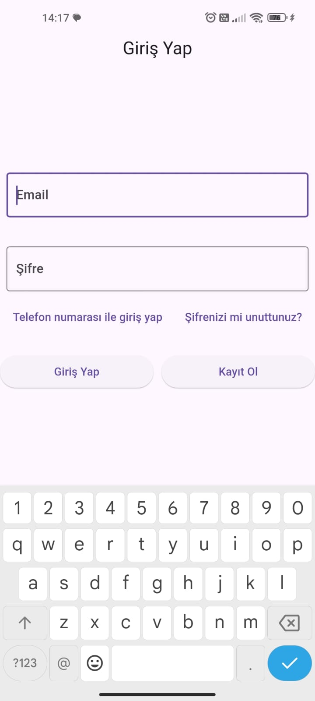
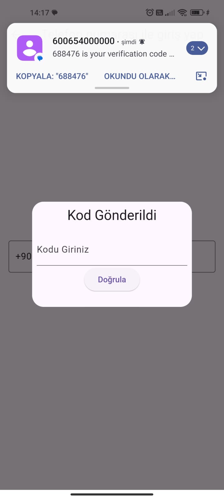

# 📱 Kullanıcı Yönetim Sistemi - Flutter Uygulaması


Firebase tabanlı, GetX ile geliştirilmiş profesyonel kullanıcı yönetim uygulaması. E-posta ve telefon doğrulamalı güvenli giriş sistemi ile tam CRUD işlemleri desteği.

<div align="center">
  
  
  
  
</div>

## ✨ Temel Özellikler

### 🔐 Çoklu Kimlik Doğrulama
- E-posta/şifre ile giriş
- Telefon numarası ve OTP doğrulama
- Firebase Authentication entegrasyonu
- Güvenli oturum yönetimi

### 👥 Kullanıcı Yönetimi
- Kullanıcı CRUD işlemleri
- Profil fotoğrafı yükleme
- Kullanıcı bilgilerini güncelleme
- Hesap silme özelliği

### 📱 Modern Arayüz
- Responsive tasarım
- Kullanıcı dostu formlar
- SMS doğrulama akışı
- Kullanıcı listeleme paneli

## 📱 Ekran Görüntüleri

<div align="center">
  <table>
    <tr>
      <td></td>
      <td></td>
      <td></td>
    </tr>
    <tr>
      <td><i>E-posta Girişi</i></td>
      <td><i>Telefon Girişi</i></td>
      <td><i>OTP Doğrulama</i></td>
    </tr>
  </table>

  <table>
    <tr>
      <td></td>
    </tr>
    <tr>
      <td><i>Kullanıcı Yönetim Paneli</i></td>
    </tr>
  </table>
</div>

## 🛠️ Kullanılan Teknolojiler

| Bileşen          | Teknoloji                     | Açıklama                          |
|------------------|-------------------------------|-----------------------------------|
| Framework        | Flutter                       | Çapraz platform geliştirme        |
| State Management | GetX                          | Uygulama durum yönetimi           |
| Backend          | Firebase                      | Veritabanı ve kimlik doğrulama    |
| Authentication   | Firebase Auth + OTP           | SMS doğrulama sistemi             |
| Database         | Firestore                     | Kullanıcı verilerinin saklanması  |

## 📦 Kurulum

1. Projeyi klonlayın:
```bash
git clone https://github.com/kullaniciAdiniz/kullanici-yonetim.git
```

2. Bağımlılıkları yükleyin:
```bash
flutter pub get
```

3. Firebase yapılandırması:
- `google-services.json` dosyasını `android/app` dizinine ekleyin
- Firebase konsolunda Authentication ve Firestore'u etkinleştirin
- SMS doğrulama sağlayıcısını ayarlayın

4. Uygulamayı çalıştırın:
```bash
flutter run
```

## 📊 Veri Modeli

```dart
class Kullanici {
  String id;
  String ad;
  String email;
  String telefon;
  String fotoUrl;
  int yas;
  DateTime kayitTarihi;
  DateTime guncellemeTarihi;

  // CRUD işlemleri için metodlar
  Future<void> kaydet() async {...}
  Future<void> guncelle() async {...}
  Future<void> sil() async {...}
}
```

## 🌟 Öne Çıkan Kod Yapıları

```dart
// SMS Doğrulama İşlemi
Future<void> telefonlaGirisYap(String telefon) async {
  await FirebaseAuth.instance.verifyPhoneNumber(
    phoneNumber: telefon,
    verificationCompleted: (credential) async {...},
    verificationFailed: (error) {...},
    codeSent: (verificationId, forceResendingToken) {...},
    codeAutoRetrievalTimeout: (verificationId) {...},
  );
}

// Kullanıcı Listeleme
StreamBuilder<QuerySnapshot>(
  stream: FirebaseFirestore.instance.collection('kullanicilar').snapshots(),
  builder: (context, snapshot) {
    if (!snapshot.hasData) return LoadingWidget();
    return ListView.builder(
      itemCount: snapshot.data!.docs.length,
      itemBuilder: (context, index) {
        var kullanici = Kullanici.fromMap(snapshot.data!.docs[index].data());
        return KullaniciKarti(kullanici: kullanici);
      },
    );
  },
)
```

## 📝 Proje Yapısı

```
lib/
├── core/
│   ├── constants/      # Sabitler ve yapılandırmalar
│   ├── utils/          # Yardımcı fonksiyonlar
│   └── themes/         # Uygulama teması
├── data/
│   ├── models/         # Veri modelleri
│   └── repositories/   # Firebase işlemleri
├── modules/
│   ├── auth/           # Kimlik doğrulama
│   ├── user/           # Kullanıcı işlemleri
│   └── crud/           # CRUD operasyonları
└── shared/             # Ortak widget'lar
```
